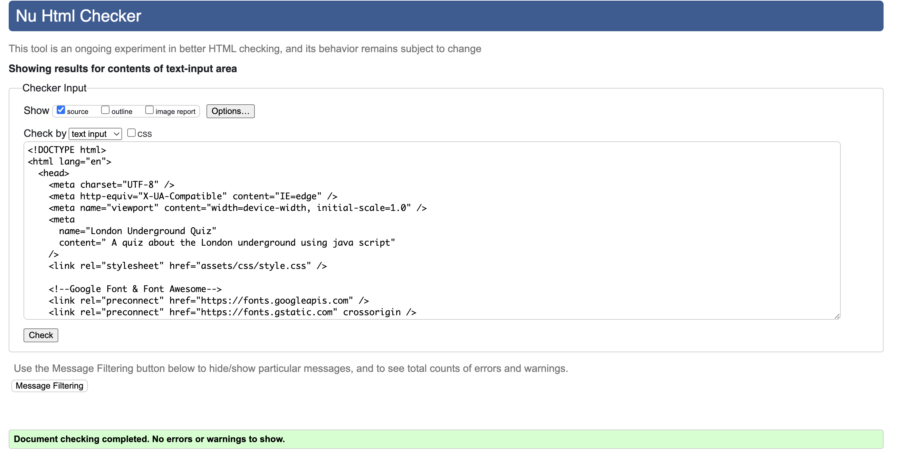

# London Underground Quiz - The quiz about the worlds oldest rapid transit system

## Introduction
This quiz was created by Beth Allaway.
The London Underground Quiz is a quiz to test peoples knowledge about the Tube.
It asks the user 15 questions and shows them their score as they go along.
At the end it shows them a message, depending on how well they do.

## Planning Stage
###  Target Audience
- Users who want to test their knowledge on the London Underground.
- Users who want to know trivial facts about the Tube.
- Users who want to kill a little time by completing a small quiz instead of being on social media.

### User Stories
- As a user, I want know know facts about the London Underground.
- I want to know what question I am on.
- I want to know if I got a answer right or wrong after I answered the question.
- I want to know my score as I go along the quiz.
- I want to restart the quiz whenever I choose.

### Site Aims
- For users to leave the site learning something new.
- To encourage them to play more quizes.
- To educate the user in their free time instead of going on social media.
- To encourage them to carry on researching about the history and present day trivia about the Underground.

### Colour Schemes
- I used [Coolors](https://coolors.co/de2110-ffffff-000000-0009ab) to help me compare the colours I had in mind for this project.
- I used the corperate colours of the London Underground Vermillion red #de2110 and Zaffre blue #0009ab to match the logo. I also used black #000000 and white #FFFFFF to used as main text colours so the quiz can be readable.

### Typeography
- I used [Google Fonts](https://fonts.google.com/) to pick the font I was after.
- The main font used for the London Underground (Johnston Typeface) is not avaliable on Google Fonts, so I used one that I thought was simular.
- I used "Open Sans" as the only font in this project as I wanted the font as close to the Johnston Typeface as possible.
- I used it for the titles, in the roundals and the body of the quiz.
- It is easy to read, simple and does not take any attention away from the quiz.
- The back up font I used just in case the users browers cannot use "Open Sans" is Sans Serif.

## Page Content
### General Layout
- The h1 is in the chosen font of "Open Sans" in white, with a vermillion red shadow. This makes it stand out from the rest of the text. The letter spacing has been set to -3, to push the letters together. The background is my chosen blue that is slightly transparent so the background can be seen behind it.
- The reset button is located in the bottom left corner of the page. It has the exact same colour scheme as the h1. When the game is in process or finished, the player can choose to press the reset to start again if they want to improve their score. When the button is hovered over, the background and shadow colors swap around.
- In the bottom right of the screen is a logo link to my GitHub page that opens in another tab. It is white, so it stands out aganist the background.
- There is a favicon icon in the tab, that is a TFL logo.

### Start Page
- The start page is the first page the user will see when visiting the site.
- In the centre, there is a transparent white background. It is transparent so the background can still be seen behind it. Inside it is text that welcomes the user. Underneath is an image of a TFL roundal that says START. Clicking on this starts the game, by sending the user to the first question.

### The Quiz
- The text in the white game area is in black for readability with the "Open Sans" font.
- As soon as the user hits the start button, the white game area widens and the first question appears. There are 15 question and each question has a choice of 4 possible answers. To choose their answer, the user will then click one of the possible answers that then fills in its corrisponding radio button.
- Just below the white game area is a submit button that is in a shape of a TFL roundal. When the user has decided on their answer, they will then click on the submit button. This will then tell them if they got the answer correct and take them to the next question.
- There is a pop up that tells the user if the answer they have chosen is correct or incorrect. This is shown on the screen for 2 seconds before going onto the next question.
- If the player tries to press submit without selecting an answer, a pop up tells the user to select an answer.
- Located at the top left of the screen we have the question counter. It is a TFL roundal with QUESTION inside it. When the game starts, a large 1 in a transparent white will appear over the top of the roundal. When a new question is shown, the number is added by 1.
- On the upper right hand side of the page is the score counter. Every time the user gets a questio correct, the score is added by one. If the user gets it wrong, the score stays the same. The score roundal appears the exact same as the question roundal, but has SCORE in its text.

### End Results Page
- When the user has finished the quiz, the game will take them to the results page. The score will still be shown in the top right and the game area will turn a transparent vermillion red, that has a message inside it, in white "Open Sans" font.
- The message will be different, depending on the score the user got. If the user got between 0-5, the game will tell the user to try again while giving them encouragement. If the user got 6-11, the game will congratulate and ask the player if they can beat there score. If the player got a score of 12-15, the game will tell them it's highest praise, calling them an Underground Whiz!
- If the player would like to start again, the reset button will take them back to the beginning.
- Please note that the submit button is not on the screen.

## Future Enhancements
- I would create more quizes with TFL themes like the London Overground, the DLR and the ELizabeth Line.
- I would like to add a main menu with all the quiz subjects in one place.
- A feedback page would be useful to see peoples comments and to find out if people are learning from them.

## Testing
### Lighhouse
- I used [Lighthouse](https://chrome.google.com/webstore/detail/lighthouse/blipmdconlkpinefehnmjammfjpmpbjk?hl=en), the Google chrome tool to test the pages. The results are below.

### W3C HTML Validator
- I used [W3C's](https://validator.w3.org/) HTML validator to test the HTML on the website.
- On the first test I got the following errors.
- I had an empty h3 - so I added text.
- I had an unecessary aria-label - so I removed it.
- I had my <li> outside the <ol> instead of the other way round. - So I swapped them round.

- After fixing the errors, I had none.

### W3C CSS Validator
I used [W3C](https://jigsaw.w3.org/css-validator/) again, this time for its CSS validator. After only testing it once, I found that there were no errors in the pages CSS.

### JSHint JavaScript Validator
- I used [JSHint](https://jshint.com/) to check my JS code. 

### Manual Testing 
- I tested the website on Chrome, Safari and Edge.
- The website loaded at a suitable rate, the background image and roundals loaded appeared at the same time.
- The questions loaded and clicking the answers involved no lag.
- The counters counted at a decent rate.

### Testing on a Mobile Phone
- I manually tested the quiz on my I-Phone 12.
- The quiz moved smoothly and all the pop ups worked.
- Everything was visable and the necessary media queries worked.
- The main h1 heading is not visable as it would cause the quiz to scroll left/right to navigate the quiz, as seen in the media query CSS.

## Bugs
- Issue: Quiz was able to be scolled left to right on a smaller than standard screen.
- Cause: The h1 heading.
- Resolution: Removed the h1 reading for smaller screens via media query.

- Issue: The reset, submit and GitHub buttons were bouncing on the screen as soon as submit was clicked.
- Cause: The sweet alert pop up.
- Resolution: Set the popup auto height to false.

- Issue: When reset button is clicked at the start screen, it starts the game while the start button is still on screen.
- Cause: Reset button being on screen with the start button.
- Resolution: Remove the reset button on the start screen.

## Deployment
- I deployed my site my doing the following:-
- Going into my repositopry on Gtihub.
- Clicking the repository's settings.
- On the left hand side, there is a menu item called 'Pages'
- I made sure the Branch was on 'Main'
- I gave the title project-two-underground-quiz and clicked 'Save'
- I clicked the link to make sure it worked.
- I then copied the link and added it to the about section in my repository.
- You can find the live site here. https://bethieieio.github.io/project-two-underground-quiz/

 ## Technology
 - I used the folowing techology in this project:
- HTML5
- CSS3
- JavaScript
- [Font Awesome](https://fontawesome.com/) - for the GitHub link
- [Google Fonts](https://fonts.google.com/) - for the font.
- [GitHub](https://github.com) - for keeping my work safe and deploying it.
- [Optimizilla](https://imagecompressor.com/) - to shrink the background image so it would load at a suitable speed.
- [SweetAlert2](https://sweetalert2.github.io/#download) - the code for the correct/incorrect answer pop ups.

